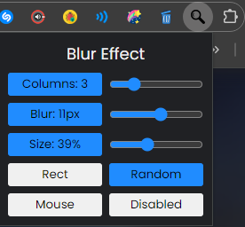

# Blur Effect Chrome Extention

## Bloat Remover Extension

Extension should be used with Google Page Bloat Remover Extension Install on page: [https://github.com/MichaelSamarati/googlebloatremoverbrowserextension](https://github.com/MichaelSamarati/googlebloatremoverbrowserextension)

